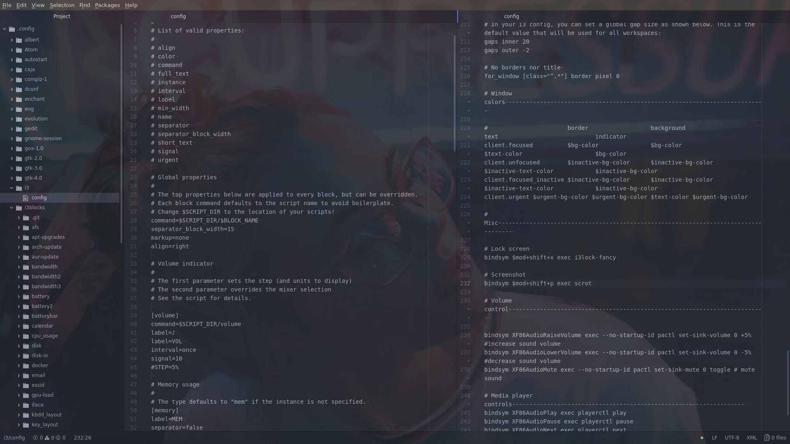
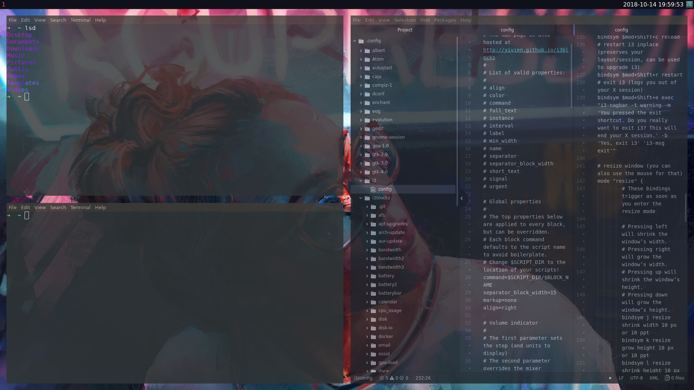

# dotfiles
All of my personal dotfiles. They are not very original, they include segments from across the internet. I recommend looking [here](https://www.reddit.com/r/unixporn) for original files and more sophisticated i3 configurations.

#### Screens
Screen 1:

Screen 2:

#### Background Image
I do not own nor did I produce this image, it is available [here](https://www.reddit.com/r/Art/comments/7weunw/neon_aaron_griffin_digital_2017/).

#### Dependencies
* Shell: zsh (oh-my-zsh)
* Terminal: mate-terminal
* Windows manager: i3-gaps
* Status bar: i3blocks
* Lock screen: i3lock-fancy
* Theme: Arc-dark
* Icons: La-Capitaine
* Albert
* Caja
* Compton
* feh
* lolcat
* xclip
* make
* cmake
* git
* curl
* gnome-tweak-tool
* vim
* tabliss - firefox extension
* Easy Installation with apt: sudo apt install zsh caja mate-terminal feh lolcat make cmake xclip git curl gnome-tweaks vim
* The following must be installed separately: Albert, compton, i3-gaps, oh-my-zsh, arc gtk theme, la capitaine icons, and tabliss (firefox extension)

This build was created using Ubuntu 18.04 desktop, these same configuration files also work with any other debian based operating system (and debian) as long as the gnome desktop is installed. For other operating systems, change the line in the i3 conf that imports the GTK themes.

#### Some Other Common Utilities
* pandoc
* htop
* python-pip
* linux-headers-'uname -r'
* tmux
* compizconfig-settings-manager
* compiz-plugins-extra
